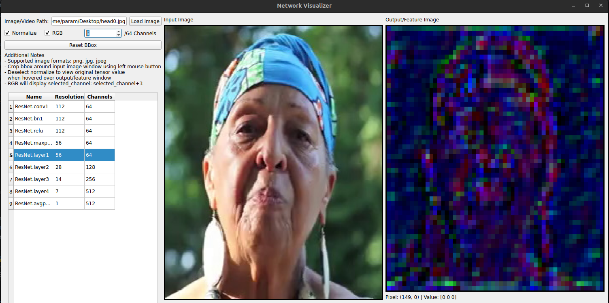

# Deep Feature Explorer
Visualize intermediate activations of a network for any image in a very intuitive UI. Retrieves intermediate 
feature maps from the network and displays them. 




## Installation
```bash
pip install git+https://github.com/pfgurus/DeepFeatureExplorer.git
```

## Usage
- Register modules/networks
- Define forward_function
- Run

## Example (ResNet18)
```python
import torch.nn.functional as F
from torchvision.models import resnet18
import torch
import dfe.common.world as world
from dfe import NetworkVisualizer

world.set_device()  # Automatically chooses cuda if available

encoder = resnet18(pretrained=True)

# Setup
viz = NetworkVisualizer()
viz.register_module(encoder, depth=1)  # Adds hooks to save intermediate outputs, depth = 2 for two level deep children

def forward_fn(x: torch.Tensor):  # Always take in [-1,1] BCHW tensor
    x = F.interpolate(x, (224, 224))  # Resizing, other preprocessing should be done here
    z = encoder(x)
    return {
        'z': z}  # Always return a dictionary since intermediate feature maps are added to this

# Set your forward function
viz.set_forward(forward_fn)
viz.run()
```

## Example (Custom Encoder Decoder)
```python

from dfe import NetworkVisualizer
import torch.nn.functional as F
import torch

encoder = SomeEncoder() # nn.Module
decoder = SomeDecoder() # nn.Module

# Setup
viz = NetworkVisualizer()
viz.register_module(encoder)
viz.register_module(decoder)

def forward_fn(x: torch.Tensor): # Always take in [-1,1] BCHW tensor
    x = F.interpolate(x, (224, 224)) # Resizing, other preprocessing should be done here
    z = encoder(x)
    g_img = decoder(z)
    return {'img': g_img}  # Always return a dictionary since intermediate feature maps are added to this

# Set your forward function
viz.set_forward(forward_fn)
viz.run()
```